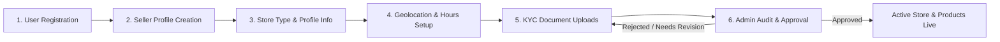
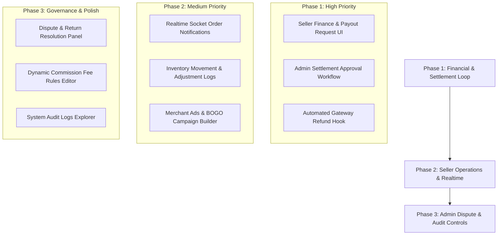

# 📊 Seller & Admin Side Evaluation, Requirements & Technical Roadmap

_Date: August 18, 2026_  
_Scope: `mapanytime-api` & `mapanytime-market-web`_

---

## 📝 1. Registration & Verification Requirements Matrix

### 🛒 A. Buyer Registration Requirements

| Step / Area                        | Required Information & Validations                                                                                                                                                                                                                 | System Lifecycle / Model                                        |
| :--------------------------------- | :------------------------------------------------------------------------------------------------------------------------------------------------------------------------------------------------------------------------------------------------- | :-------------------------------------------------------------- |
| **1. Sign Up (`/register`)**       | - `email` (Unique, valid format) - `password` (PBKDF2 salted hash, min 8 chars) - `firstName` & `lastName` - `countryCode` (Default: `PH`)                                                                                                | `Users` table created with `BUYER` role and status `ACTIVE`.    |
| **2. Buyer Profile**               | - `displayName` (Defaults to full name or email) - Phone number                                                                                                                                                                                 | `Buyers` table record auto-linked to `userId`.                  |
| **3. Checkout / Shipping Address** | - `recipientName` - `phoneNumber` (+63 format) - `addressLine1` & `addressLine2` - `barangay` - `city` (e.g. Baguio City) - `province` (e.g. Benguet) - `zipCode` (e.g. 2600) - `country` (Philippines) - `isDefault` flag | `BuyerAddresses` record (`ADDRESSTYPE.SHIPPING` or `BILLING`).  |
| **4. Payment Method Options**      | - PayMongo (GCash, Maya, Cards, E-Wallets) - Cash On Delivery (COD) - Bank Transfer                                                                                                                                                          | Linked dynamically via `PaymentMethods` and `PaymentProviders`. |

---

### 🏪 B. Seller Registration & Store Onboarding Requirements

| Onboarding Step                            | Requirements & Field Specifications                                                                                                                                                                                                                                                                                                                                                                              | Related Database Models                              |
| :----------------------------------------- | :--------------------------------------------------------------------------------------------------------------------------------------------------------------------------------------------------------------------------------------------------------------------------------------------------------------------------------------------------------------------------------------------------------------- | :--------------------------------------------------- |
| **Step 1: Account Creation**               | - `email`, `password`, `firstName`, `lastName`, `phone`, `countryCode` - Assigned `SELLER` role                                                                                                                                                                                                                                                                                                               | `Users`, `Roles` (`UserRoles`)                       |
| **Step 2: Seller Profile Setup**           | - `sellerPlan`: `STANDARD` or `PRO` - `onboardingStep`: Initialized to `0` - `applicationStatus`: `PENDING`                                                                                                                                                                                                                                                                                                | `Sellers` (`ApplicationStatus`)                      |
| **Step 3: Store Classification**           | Select Store Type: - **Commercial / Retail Store** (`store`) - **House & Lot Real Estate** (`house-lot`) - **Rental Property** (`renting`)                                                                                                                                                                                                                                                              | `Stores.primaryCategoryId` / `ProductProperties`     |
| **Step 4: Store Profile & Branding**       | - `storeName` (Unique display name) - `slug` (URL identifier, e.g. `baguio-fresh-harvest`) - `description` (Business summary) - `email` & `phone` (Store customer support contact) - `logoFile` & `bannerFile` (Uploaded S3 asset IDs)                                                                                                                                                               | `Stores`, `Files` (`StoreLogo`, `StoreBanner`)       |
| **Step 5: Geolocation & Operating Hours**  | - `lat` & `lng` (Precise coordinates via Mapbox/Leaflet pin) - `currentAddress`, `barangay`, `city`, `province`, `zipCode` - `StoreHours`: Daily `openMinutes` (e.g. 480 = 08:00), `closeMinutes` (e.g. 1200 = 20:00), `isClosed` flag (e.g. Sunday)                                                                                                                                                       | `StoreLocations`, `StoreHours`                       |
| **Step 6: KYC & Legal Business Documents** | **Required for Commercial Merchant Approval:** 1. `DTI_CERTIFICATE`: DTI Business Registration Certificate (Sole Proprietor) 2. `MAYORS_PERMIT`: Mayor's / LGU Business Permit 3. `BIR_CERTIFICATE`: BIR Form 2303 Certificate of Registration 4. `SEC_CERTIFICATE`: SEC Certificate (for Partnerships & Corporations) 5. `GOV_ID` / `TIN_ID`: Valid government-issued ID of authorized signatory | `DocumentVerifications` (`DOCUMENTTYPES`), `Files`   |
| **Step 7: Admin Verification & Go-Live**   | - Admin reviews submitted KYC documents and store legitimacy. - Approval Status: `PENDING` ➔ `ACTIVE` (or `REJECTED` with reason). - Upon `ACTIVE` status, merchant can publish products to the public marketplace.                                                                                                                                                                                        | `Stores.approvalStatus`, `Sellers.applicationStatus` |

---

## 🏪 2. Seller Side Evaluation

### ✅ Current Capabilities & Built Features

- **Multi-Store Management (`/seller/manage-stores`)**:
  - Full support for sellers owning multiple independent store profiles.
  - Active store switching context via `useActiveStore` hook and local storage synchronization.
- **Store Profile & Setup (`/seller/store-profile`)**:
  - Configurable operating hours (`StoreHours` with open/close minutes and Sunday closures).
  - Geolocation coordinates (`StoreLocations`), addresses, contact snapshots, and shipping/return policies.
- **Product Catalog & Inventory (`/seller/products`, `/seller/inventory`)**:
  - Category and subcategory classification with custom variant attributes.
  - Real-time stock reservation and deduction upon order placement.
  - Support for BOGO (Buy-One-Get-One) and promotional bundles.
- **Order Pipeline (`/seller/orders`, `/seller/dashboard`)**:
  - Order state tracking: `PENDING` ➔ `PROCESSING` ➔ `READY_FOR_PICKUP` ➔ `COMPLETED` / `CANCELLED`.
  - Aggregated metric tiles (Revenue, Pending Orders, Completed Orders, Low Stock items).
- **Specialized Verticals**:
  - Real Estate properties module (`/seller/properties`) with specification steps, document uploads, and agent review.
- **AI-Assisted Listing Creation**:
  - Multi-image parsing and batch listing entry (`/seller/ai-upload`).

### 🎯 Identified Gaps & Tasks to Tackle

| Feature Area                             | Description & Requirements                                                                                                                                                                                         | Priority   |
| :--------------------------------------- | :----------------------------------------------------------------------------------------------------------------------------------------------------------------------------------------------------------------- | :--------- |
| **1. Payout & Settlements UI**           | Create `/seller/finance` to display accumulated net seller balance, platform commission breakdowns, payout destination setup (GCash, Bank, Maya), and withdrawal history (`Settlements` & `SellerPayouts` models). | **High**   |
| **2. Inventory Movements & Adjustments** | Provide an interactive stock adjustment modal with audit reason codes (`RESTOCK`, `DAMAGE`, `RETURN`, `CORRECTION`) writing directly to `InventoryMovements`.                                                      | **Medium** |
| **3. Low Stock Alerts**                  | Automatic visual warning badges and email/in-app notifications when `quantityOnHand <= reorderPoint`.                                                                                                              | **Medium** |
| **4. Promotions & Merchant Ads Manager** | UI to create, activate, and schedule banner advertisements, BOGO campaigns, and event notices (`MerchantAds` table) from `/seller/products`.                                                                       | **Medium** |
| **5. Live Order Notifications**          | Connect the Socket.IO client in the seller shell to trigger toast notifications and sound cues upon receiving new `ORDER_CREATED` events.                                                                          | **Medium** |
| **6. Store Reviews & Rating Response**   | Seller view under `/seller/reviews` allowing merchants to view customer feedback, ratings, and publish replies.                                                                                                    | **Low**    |

---

## 🛡️ 3. Admin Side Evaluation

### ✅ Current Capabilities & Built Features

- **Global Metrics Dashboard (`/admin`)**:
  - System-wide revenue, gross orders, active store counts, and user registration totals.
- **Merchant & Store Verification (`/admin/stores`, `/admin`)**:
  - Application review queue for approving or rejecting new store registrations and KYC documents (`DocumentVerifications`).
- **Granular RBAC (`/admin/permissions`)**:
  - Role-to-permission mapping matrices, role creation, and secure backend middleware enforcement.
- **User Management (`/admin/users`)**:
  - Filterable user table supporting role assignments, email verification, and account suspensions.
- **Category & Taxonomy Management (`/admin/categories`)**:
  - Hierarchical category builder with parent-child relationships and category-level commission rates.
- **App Releases (`/admin/app-releases`)**:
  - Version distribution and release notes publisher for mobile clients.

### 🎯 Identified Gaps & Tasks to Tackle

| Feature Area                                           | Description & Requirements                                                                                                                                                 | Priority   |
| :----------------------------------------------------- | :------------------------------------------------------------------------------------------------------------------------------------------------------------------------- | :--------- |
| **1. Payout & Settlement Approval Hub**                | Dedicated admin review screen (`/admin/payouts`) to inspect pending seller withdrawal requests, verify deductions, and approve payouts (`PAID` / `REJECTED`).              | **High**   |
| **2. Dispute & Return Management (`/admin/orders`)**   | Arbitration interface to review buyer return/refund tickets (`ReturnRequests`), inspect uploaded evidence, and trigger gateway refunds via `PaymentService.refundPayment`. | **High**   |
| **3. Commission & Fee Dynamic Rules**                  | Configurable editor to set tiered commission rates (e.g., 5% Tech vs 10% Apparel) and fixed transaction fees (`CommissionRules` table) without database scripting.         | **Medium** |
| **4. Global Audit Logs Explorer**                      | Queryable interface over the `AuditLogs` table tracking privilege escalation, store status overrides, KYC approvals, and manual balance adjustments.                       | **Low**    |
| **5. Platform-Wide Banner & Announcement Broadcaster** | Tool for broadcasting system maintenance, holiday hours, or urgent policy updates across all buyer/seller headers.                                                         | **Low**    |

---

## 🗺️ 4. Recommended Implementation Roadmap

---

## 📌 Summary Checklist for Next Sprint

- [ ] **Seller Finance Screen**: Build `/seller/finance` with payout request form and transaction ledger.
- [ ] **Admin Settlement Approval Screen**: Build `/admin/payouts` to process pending seller withdrawals.
- [ ] **Socket Live Order Event**: Add listener hook in `mapanytime-market-web/src/app/seller/layout.tsx`.
- [ ] **Stock Movement Modal**: Implement stock adjustment in `/seller/inventory`.
- [ ] **Returns & Refunds Panel**: Implement `/admin/returns` connected to `PaymentService.refundPayment`.
