# MapAnytime — Features & System Flows

Comprehensive architecture, feature breakdown, and end-to-end user journeys for the **MapAnytime** marketplace platform.

---

## 1. System Overview & Core Personas

MapAnytime is a map-first local commerce and property marketplace for the Philippines. It connects buyers, merchants, real estate sellers, agents, and platform administrators through a centralized backend API, web portal, and mobile application.

```
                                  ┌─────────────────────────────┐
                                  │      MapAnytime API         │
                                  │   (Express, Prisma, PG)     │
                                  └──────────────┬──────────────┘
                                                 │
          ┌──────────────────────┬───────────────┴───────────────┬──────────────────────┐
          │                      │                               │                      │
┌─────────▼───────────┐ ┌────────▼────────────┐       ┌──────────▼──────────┐ ┌─────────▼───────────┐
│   Mobile App        │ │   Web Marketplace   │       │   Seller Dashboard  │ │   Admin Portal      │
│ (Flutter / Buyer)   │ │  (Next.js / Buyer)  │       │  (Next.js / Seller) │ │(Next.js / Operations)│
└─────────────────────┘ └─────────────────────┘       └─────────────────────┘ └─────────────────────┘
```

### User Personas & Roles

| Persona                | Role Key                | Primary Responsibilities & Capabilities                                                                                                                                                                            |
| :--------------------- | :---------------------- | :----------------------------------------------------------------------------------------------------------------------------------------------------------------------------------------------------------------- |
| **Buyer**              | `BUYER` / `USER`        | Geolocation discovery, storefront browsing, cart management, checkout & digital payments, pickup pass redemption, order & shipment tracking.                                                                       |
| **Seller / Merchant**  | `SELLER`                | Onboarding & verification, managing multiple stores/branches, product catalog & variant configuration, inventory management, merchant promotions & ads, order queue processing.                                    |
| **Real Estate Seller** | `SELLER`                | Listing properties (house-and-lot, raw land) with legal title docs, pricing structures, terrain metadata, and viewing dedicated property dashboards.                                                               |
| **Agent / Recruiter**  | `AGENT`                 | Onboarding and recruiting merchants/sellers, tracking onboarding progress and recruit pipelines.                                                                                                                   |
| **Administrator**      | `ADMIN` / `SUPER_ADMIN` | Store and property KYC approval queues, dynamic RBAC permission management, category tree administration, pricing engine fee rule configuration, platform analytics, mobile app release & force-update governance. |

---

## 2. Feature Matrix by Domain

### 2.1 Identity, Access & Governance (ID & ADM)

- **Multi-Method Auth**: Email/password registration and Google OAuth 2.0 integration.
- **Session & Token Management**: JWT-based access tokens with refresh token rotation and server-side invalidation on logout.
- **Dynamic RBAC**: Runtime role-to-permission resolution where administrators can configure fine-grained endpoint grants without redeploying code.
- **Account State Machine**: Account lifecycle management (`ACTIVE`, `SUSPENDED`, `PENDING_VERIFICATION`).
- **App Release Control**: Mobile version registry supporting min-version checks and mandatory forced-update gates for Flutter client releases.
- **Audit Logging**: Structured event logging for sensitive administrative actions.

### 2.2 Store & Merchant Management (STO)

- **Seller Capacity Declaration**: Support for `OWNER`, `BROKER`, and `PROXY` operating models.
- **KYC & Document Verification**: Submission of BIR registration certificates, government IDs, and operational permits.
- **Store Approval Workflow**: Multi-state approval pipeline (`PENDING`, `APPROVED`, `REJECTED`) with rejection reason tracking.
- **Multi-Store Tenancy**: A single merchant account can own, operate, and switch between multiple distinct physical store locations.
- **Store Profiles**: Configurable daily operating hours, GPS coordinates (latitude/longitude), contact numbers, branding banners, and logos.

### 2.3 Map & Discovery Engine (MAP & ADS)

- **Radius-Based Store Search**: Geolocation spatial querying (`GET /stores/nearby`) allowing buyers to discover active stores within configurable distance radiuses (1–50 km).
- **Interactive Storefront Pins**: Map pins displaying store distance, operating status (open/closed), and fast navigation into store catalogs.
- **Sponsored Proximity Ads**: Proximity-targeted merchant advertising pins highlighting deals and featured sellers within the buyer's vicinity.
- **Storefront Landing Pages**: Store-specific web and mobile landing pages featuring curated collections, operating hours, and verified badges.

### 2.4 Catalog & Inventory Management (CAT & INV)

- **Rich Product Catalog**: Multi-image galleries, hierarchical category mapping, tags, pricing, and stock visibility (`PUBLISHED`, `DRAFT`, `ARCHIVED`).
- **Options & Variants**: Matrix generation for product options (e.g., Size, Color) with distinct SKUs, prices, and variant-specific inventory.
- **AI-Assisted Listing Ingestion**: Background image-to-listing parsing queue (`/seller/ai-upload`) to extract listing metadata automatically.
- **Supplier Product Sourcing**: Linking supplier catalog items to merchant inventory for drop-shipping or distribution.
- **Concurrency-Safe Inventory**: Optimistic locking (`version` column) for stock adjustments and restocks.
- **Time-Bound Reservations**: Automatic 15-minute stock hold upon order placement, with background scheduled sweep releasing expired holds.

### 2.5 Real Estate & Property Listings (PROP)

- **Structured Real Estate Schema**: Specialized metadata fields for house-and-lot and raw-land properties (terrain type, furnishing, title classification, negotiability, tax declaration responsibilities).
- **Property Document Attachment**: Uploading and association of land titles, blueprints, and tax certifications.
- **Property Verification Lifecycle**: Two-stage approval (`DRAFT` → `PENDING_REVIEW` → `ACTIVE` / `REJECTED`).
- **Property Seller Dashboard**: Dedicated property-specific view tracking buyer inquiries, listing engagement, and status.

### 2.6 Cart & Pricing Engine (CART & FEE)

- **Single-Store Cart Isolation**: Guardrails ensuring items in a single cart session belong to one unique store.
- **Multi-Tiered Pricing Engine**:
  - Versioned and effective-dated pricing rules.
  - Granular fee components scoped by payment provider, payment method, product category, store tier, or seller subscription.
  - Platform commission calculated on goods subtotal (2.00%) — the platform's only revenue line.
  - **Per-method buyer transaction fee**: the contracted PayMongo rate for the method the buyer actually chose — GCash 2.23%, Maya 1.79%, domestic card 3.125% + ₱13.39, cash 0% — passed through in full. There is no platform margin on top; the fee is cost recovery, not revenue.
  - **Gross-up**: the fee is charged as `(amount × rate + fixed) / (1 − rate × buyerShare)`, because the gateway bills against the captured total rather than the goods total. Without it the platform is short by `fee × rate` on every transaction.
  - **Method availability**: `PaymentMethods.minOrderAmount` / `maxOrderAmount` gate a method by basket size. Cards carry a ₱500 floor — a ₱13.39 flat fee is 17% of a ₱100 order.
- **No Tax Handling**: MapAnytime is a marketplace intermediary and never takes title to the goods, so it charges, holds and remits no VAT — output VAT is the seller's own liability against their own BIR registration. Listed prices are seller-set and tax-inclusive.
- **Discount & Promotion Pipeline**: Item-level percentage discounts, BOGO (Buy One Get One), flash sales, and platform voucher calculations.

### 2.7 Checkout, Payments & Settlements (PAY & LED)

- **Dynamic Payment Provider Architecture**: Data-driven payment provider model supporting multiple gateways (PayMongo for GCash, Maya, Cards, and local banks).
- **Idempotent Webhook Processing**: Cryptographic signature validation, event deduplication, and transactional state transition on `payment.paid` webhooks.
- **Immutable Charge Ledger (`OrderCharges`)**: Detailed double-entry style charge lines capturing exact payer and beneficiary pairs (`BUYER` → `PLATFORM`, `BUYER` → `MERCHANT`, `MERCHANT` → `PLATFORM`).
- **Rate Freezing**: Snapshots of platform fee rates and payment provider rates frozen directly onto the order record at creation time.
- **Settlement & Payout Batching**: Aggregation of cleared order funds into merchant settlement batches with release eligibility dates.

### 2.8 Order Lifecycle & Fulfillment (ORD)

- **Fulfillment Modes**: Dual support for **Store Pickup** (with scheduled pickup windows) and **Delivery** (with shipping address snapshotting).
- **Order State Machine**: Strict status transitions (`PENDING_PAYMENT` → `PAID` → `CONFIRMED` → `PREPARING` → `READY_FOR_PICKUP` / `SHIPPED` → `COMPLETED` / `CANCELLED`).
- **Digital Pickup Pass**: Mobile/web QR and code-based verification pass shown by the buyer at the physical store counter.
- **Shipment Tracking**: Multi-stage shipment tracking with carrier names, tracking numbers, and delivery confirmation.

### 2.9 Real-Time Communications & Async Workers (NTF & PLT)

- **WebSocket Gateway**: Real-time push updates for instant payment confirmations, order status changes, and notifications.
- **Background Event Consumers**: RabbitMQ-backed asynchronous worker processing for email delivery, notifications, and analytics ingestion.
- **Scheduled Workers**: Cron engines for releasing expired inventory reservations, evaluating matured seller payouts, and auto-cancelling stale unpaid checkouts.

### 2.10 Tri-Domain Economic Architecture — Rewards, Incentives & Commissions (ECO)

- **Three Separate Economic Ledgers**:
  1. **Buyer Loyalty (`RewardWallet` + `RewardTransactions`)**: Customer reward points earned on purchases (₱100 = 1 pt), reviews, referrals, and store visits. Redeemable for checkout discounts (100 pts = ₱10, max 20% cap). 12-month rolling expiration. Not cash.
  2. **Seller Incentives (`SellerCampaigns` + `SellerCampaignTransactions`)**: Merchant-funded marketing budgets to distribute Reward Points to buyers (e.g. "Spend ₱500 get 50 pts") with ROI analytics (GMV generated, new vs repeat customers).
  3. **Agent Commissions (`AgentCommissionAccount` + `AgentCommissionTransactions` + `AgentPayouts`)**: Real Philippine Peso (₱) commission earned by Agents when recruited merchants complete sales (e.g. 0.05% of GMV). Held in pending during the refund window before maturing for withdrawal.
- **In-Transaction Multi-Ledger Settlement**: When an order reaches `ORDERSTATUS.COMPLETED`, the single atomic Prisma `$transaction` executes:
  - Updates Order status to `COMPLETED`
  - Creates Seller Settlement (platform owes merchant)
  - Credits Buyer Reward Points (`PURCHASE`, 12m expiry)
  - Credits Agent Commission to pending (`SALE_COMMISSION`, maturing in 7 days)
  - All-or-nothing rollback; zero RabbitMQ dependency for core financial ledgers.
- **Dynamic Administration**: `RewardConfigurations` and `AgentCommissionConfigurations` allow Admins to modify earning rates, redemption caps, and commission rates in real time without code redeployments.
- **Reconciliation & Auditing**: Scheduled crons verify wallet and commission account balances against ledger sums, logging alerts for any discrepancy.

---

## 3. Detailed End-to-End System Flows

### Flow 1: User Registration & Authentication Flow

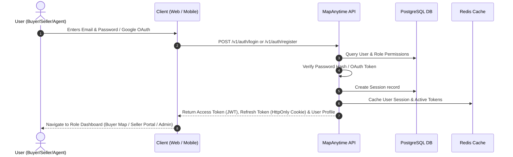

---

### Flow 2: Seller Onboarding & Store Verification Flow

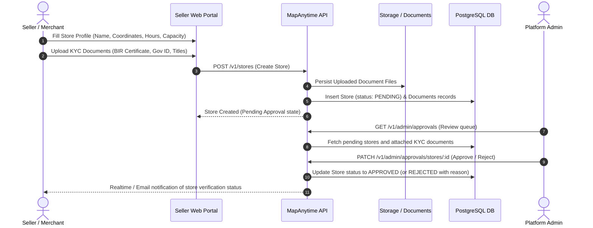

---

### Flow 3: Buyer Map Discovery & Storefront Browsing Flow

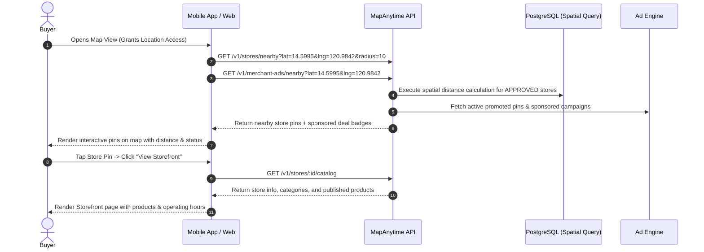

---

### Flow 4: Product Listing & AI-Assisted Upload Flow

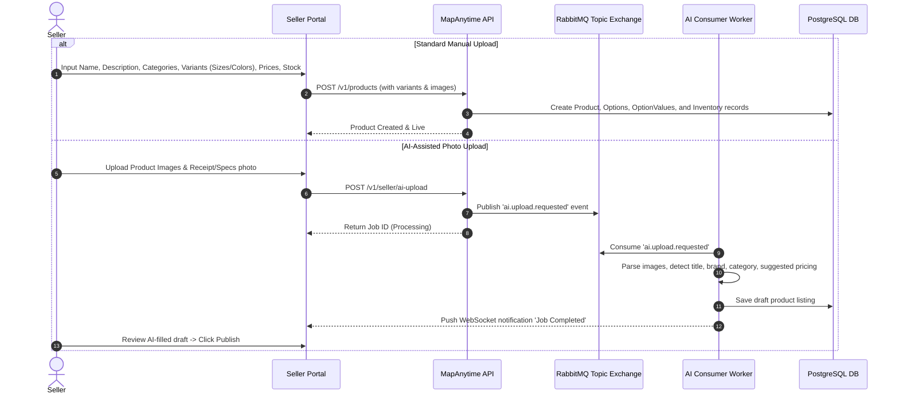

---

### Flow 5: Cart, Stock Reservation & Pricing Preview Flow

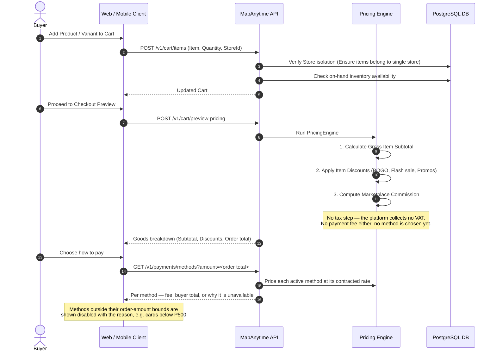

---

### Flow 6: Order Creation, PayMongo Payment & Webhook Execution Flow

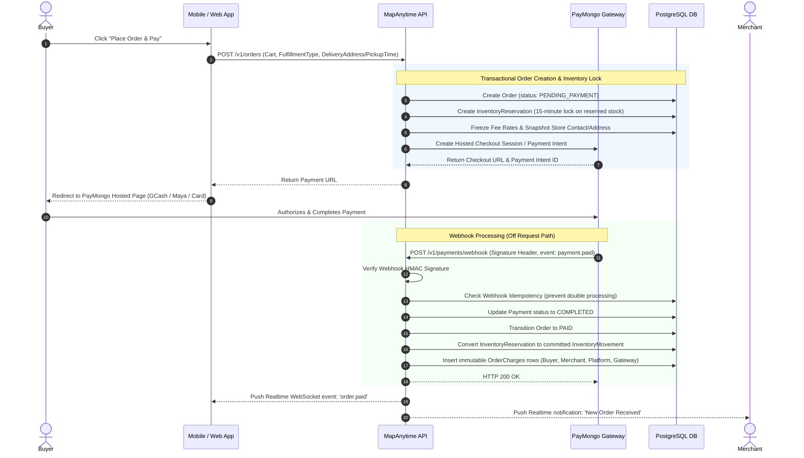

---

### Flow 7: Order Fulfillment — Pickup Pass vs. Delivery Shipping

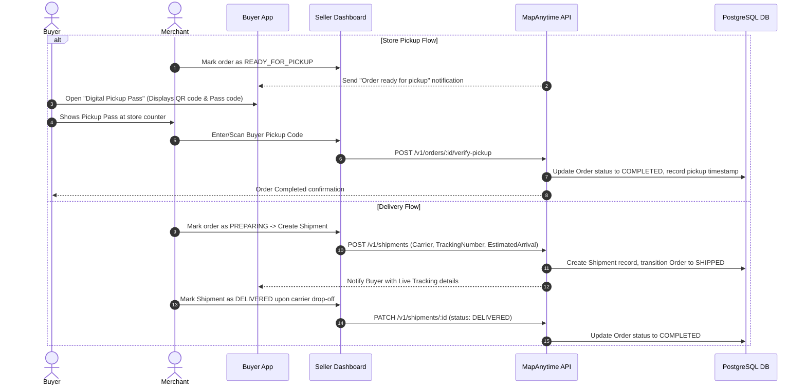

---

### Flow 8: Merchant Advertising & Attribution Flow

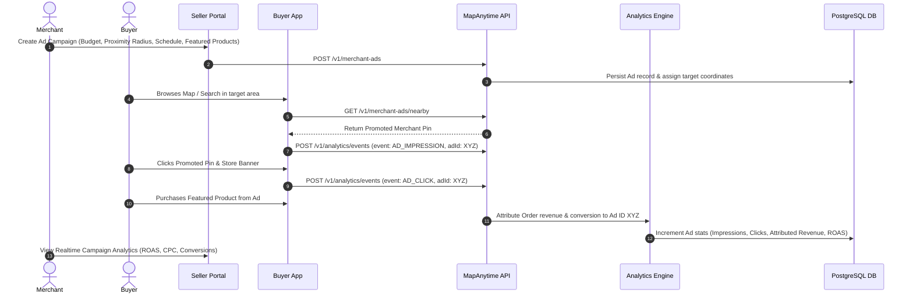

---

### Flow 9: Agent Recruitment & Merchant Onboarding Pipeline

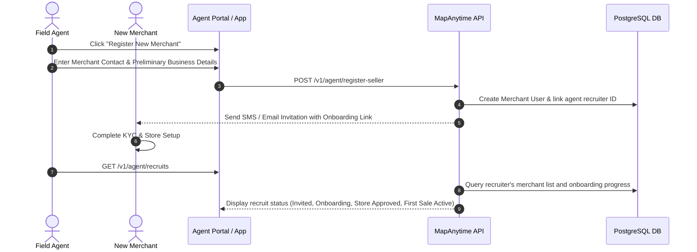

---

### Flow 10: Financial Charge Ledger & Settlement Pipeline

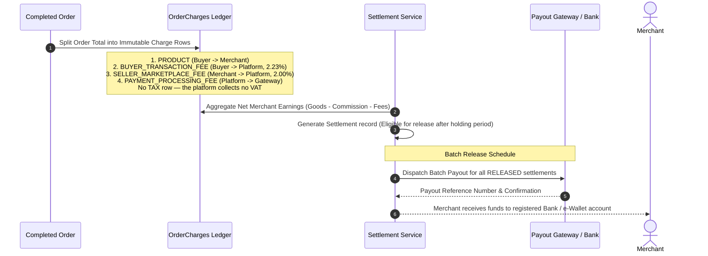

---

### Flow 11: Multi-Ledger Settlement Lifecycle (Rewards, Seller Settlement & Agent Commission)

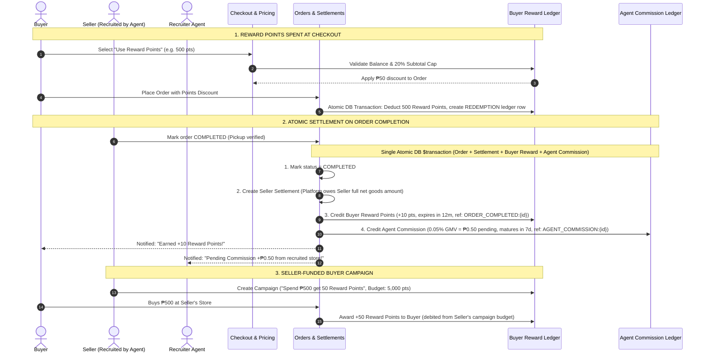

---

## 4. Key Data Entities & Relationship Map

```mermaid
erDiagram
    Users ||--o{ Sessions : has
    Users ||--o{ Stores : owns
    Users ||--o{ Orders : places
    Users ||--o{ Documents : submits
    Users ||--o| Buyers : registers
    Users ||--o| Sellers : registers

    Buyers ||--o| RewardWallet : owns
    RewardWallet ||--o{ RewardTransactions : logs

    Sellers ||--o{ SellerCampaigns : launches
    SellerCampaigns ||--o{ SellerCampaignTransactions : logs

    Users ||--o| AgentCommissionAccount : holds
    AgentCommissionAccount ||--o{ AgentCommissionTransactions : logs
    AgentCommissionAccount ||--o{ AgentPayouts : requests

    Stores ||--o{ StoreHours : configures
    Stores ||--o{ Products : offers
    Stores ||--o{ ProductProperties : lists
    Stores ||--o{ Orders : receives
    Stores ||--o{ MerchantAds : runs
    Stores ||--o{ Inventory : stocks

    Products ||--o{ ProductImages : contains
    Products ||--o{ ProductOptions : has
    Products ||--o{ ProductVariants : produces
    ProductVariants ||--o{ Inventory : tracks

    Orders ||--|{ OrderItems : contains
    Orders ||--o{ OrderCharges : ledgers
    Orders ||--o{ InventoryReservations : locks
    Orders ||--o{ Shipments : fulfills
    Orders ||--o{ Payments : pays
    Orders ||--o{ RewardTransactions : references
    Orders ||--o{ AgentCommissionTransactions : references

    RewardConfigurations ||--o{ RewardWallet : configures
    AgentCommissionConfigurations ||--o{ AgentCommissionAccount : configures
    PricingConfigurations ||--o{ PricingComponents : defines
    MerchantAds ||--o{ MerchantAdProducts : targets
    MerchantAds ||--o{ AdEvents : records
```

    Stores ||--o{ StoreHours : configures
    Stores ||--o{ Products : offers
    Stores ||--o{ ProductProperties : lists
    Stores ||--o{ Orders : receives
    Stores ||--o{ MerchantAds : runs
    Stores ||--o{ Inventory : stocks

    Products ||--o{ ProductImages : contains
    Products ||--o{ ProductOptions : has
    Products ||--o{ ProductVariants : produces
    ProductVariants ||--o{ Inventory : tracks

    Orders ||--|{ OrderItems : contains
    Orders ||--o{ OrderCharges : ledgers
    Orders ||--o{ InventoryReservations : locks
    Orders ||--o{ Shipments : fulfills
    Orders ||--o{ Payments : pays
    Orders ||--o{ RewardTransactions : references

    PricingConfigurations ||--o{ PricingComponents : defines
    MerchantAds ||--o{ MerchantAdProducts : targets
    MerchantAds ||--o{ AdEvents : records

```

---

## 5. Technology Stack Summary

| Layer | Technologies Used |
| :--- | :--- |
| **Backend API** | Node.js, Express, TypeScript, Prisma ORM, PostgreSQL (Spatial/PostGIS queries), Redis, RabbitMQ |
| **Payment Gateway** | PayMongo API (GCash, Maya, Credit/Debit Cards, QR Ph) |
| **Web Frontend** | Next.js (App Router), React, TypeScript, TailwindCSS, Zustand / React Query |
| **Mobile App** | Flutter (Dart), Google Maps Flutter / Mapbox, Provider / Riverpod |
| **Infrastructure & Ops** | Docker, Nginx, Linux (Ubuntu), PM2, GitHub Actions CI/CD |

---
*Generated: 2026-08-20 — Source of truth for MapAnytime Marketplace Features and System Flows.*
```
