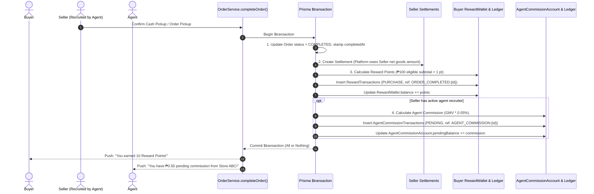

# MAPANYTIME — REWARD, INCENTIVE & COMMISSION SYSTEM

## MASTER TECHNICAL ARCHITECTURE & BUSINESS SPECIFICATION

**STATUS:** RECOMMENDED ARCHITECTURE — SOURCE OF TRUTH

---

## 1. CORE ARCHITECTURAL PRINCIPLE: THREE DISTINCT ECONOMIC LEDGERS

MapAnytime separates marketplace economics into three distinct, dedicated systems rather than forcing all participants into a generic "points" or "tokens" bucket:

```
                                  MAPANYTIME PLATFORM
                                           │
              ┌────────────────────────────┼────────────────────────────┐
              │                            │                            │
           BUYER                        SELLER                        AGENT
              │                            │                            │
       Loyalty Rewards               Seller Incentives             Commissions
     (Discounts & Points)          (Campaigns & Budgets)         (Real PHP Earnings)
              │                            │                            │
        RewardWallet                 SellerCampaign           AgentCommissionAccount
              │                            │                            │
      RewardTransaction            CampaignTransaction         CommissionTransaction
              │                            │                            │
      RewardConfiguration        SellerCampaignConfig       AgentCommissionConfig
```

| System                   | Role   | Entity Name                                             | Currency / Unit                                    | Economic Meaning                                                                               |
| :----------------------- | :----- | :------------------------------------------------------ | :------------------------------------------------- | :--------------------------------------------------------------------------------------------- |
| **1. Buyer Rewards**     | Buyer  | `RewardWallet` + `RewardTransaction`                    | **Reward Points** (Off-chain points)               | Loyalty discount on future purchases (100 pts = ₱10, max 20% cap). Not cash.                   |
| **2. Seller Incentives** | Seller | `SellerCampaign` + `SellerCampaignTransaction`          | **Campaign Marketing Spend** (PHP / Points budget) | Merchant-funded promotions to attract buyers (e.g. "Spend ₱500 get 50 pts"). Tracks ROI.       |
| **3. Agent Commissions** | Agent  | `AgentCommissionAccount` + `AgentCommissionTransaction` | **Philippine Peso (₱)** (Real Money)               | Recruiter commission earned when recruited sellers generate successful sales. Payout-eligible. |

---

## 2. BUYER REWARD SYSTEM (MAPANYTIME REWARDS)

### A. Core Economics

- **User-Facing Name:** Reward Points (e.g. "1,250 Reward Points $\approx$ ₱125 in discount value").
- **Default Earning Rate:** **₱100 eligible purchase = 1 Reward Point** (~1% reward rate).
- **Calculation Base:** Calculated strictly on eligible net goods subtotal (`subtotal - merchant discounts`), excluding buyer fees (2.23%), payment gateway fees, platform commissions, shipping, and taxes.
- **Default Redemption Value:** **100 Reward Points = ₱10 discount** (₱0.10 per point).
- **Maximum Redemption Cap:** Reward points can cover a maximum of **20% of the eligible order subtotal** (enforced server-side).
- **Expiration Policy:** **12-month rolling expiration** (`expiresAt` timestamp per earning lot).

### B. Buyer Database Schema (`prisma/schema.prisma`)

```prisma
model RewardWallet {
  id             String              @id @default(cuid())
  buyerId        String              @unique
  balance        Int                 @default(0)
  pendingBalance Int                 @default(0)
  lifetimeEarned Int                 @default(0)
  lifetimeSpent  Int                 @default(0)

  createdAt      DateTime            @default(now())
  updatedAt      DateTime            @updatedAt

  buyer          Buyers              @relation(fields: [buyerId], references: [id], onDelete: Cascade)
  transactions   RewardTransactions[]

  @@index([buyerId])
}

model RewardTransactions {
  id           String                @id @default(cuid())
  walletId     String
  type         REWARDTRANSACTIONTYPE

  amount       Int
  balanceAfter Int

  orderId      String?
  referenceKey String?               @unique
  source       String?
  description  String?

  expiresAt    DateTime?
  createdAt    DateTime              @default(now())

  wallet RewardWallet @relation(
    fields: [walletId],
    references: [id],
    onDelete: Cascade
  )

  @@index([walletId, createdAt])
  @@index([orderId])
  @@index([type])
  @@index([expiresAt])
}

model RewardConfigurations {
  id                    String    @id @default(cuid())
  version               Int       @default(1)
  isActive              Boolean   @default(true)

  earnRatePhpPerPoint   Decimal   @default(100.00) @db.Decimal(10, 2) // ₱100 = 1 pt
  pointValueInPhp       Decimal   @default(0.10)   @db.Decimal(10, 4) // 1 pt = ₱0.10
  maxRedemptionRate     Decimal   @default(0.2000) @db.Decimal(5, 4)  // Max 20.00% cap
  minRedemptionPoints   Int       @default(100)
  expirationMonths      Int       @default(12)
  isEarningActive       Boolean   @default(true)
  isRedemptionActive    Boolean   @default(true)

  signupBonusPoints     Int       @default(100)
  referralBonusPoints   Int       @default(500)
  reviewBonusPoints     Int       @default(20)
  storeVisitBonusPoints Int       @default(10)

  effectiveFrom         DateTime  @default(now())
  effectiveTo           DateTime?
  updatedById           String?
  changeReason          String?
  createdAt             DateTime  @default(now())
  updatedAt             DateTime  @updatedAt

  @@index([isActive])
}

enum REWARDTRANSACTIONTYPE {
  PURCHASE
  REFERRAL
  REVIEW
  STORE_VISIT
  CAMPAIGN
  BONUS
  REDEMPTION
  REVERSAL
  EXPIRATION
  ADJUSTMENT
}
```

---

## 3. SELLER INCENTIVES & PROMOTION CAMPAIGNS

### A. Purpose & Separation

Sellers do not hold a buyer reward wallet. Instead, sellers run **promotional campaigns** that distribute `RewardPoints` to buyers from a merchant-funded marketing budget:

- _Example:_ Store ABC creates a _"Spend ₱500 and earn 50 Reward Points"_ campaign with a budget of 5,000 points.
- When a buyer qualifies, the buyer receives 50 points; the seller's campaign ledger records the points granted, marketing cost, and resulting GMV.

### B. Seller Campaign Database Schema

```prisma
model SellerCampaigns {
  id              String                @id @default(cuid())
  sellerId        String
  storeId         String?
  name            String
  type            SELLERCAMPAIGNTYPE    @default(BONUS_POINTS)
  status          CAMPAIGNSTATUS        @default(DRAFT)

  startDate       DateTime
  endDate         DateTime
  budgetAmount    Decimal               @db.Decimal(12, 2)
  spentAmount     Decimal               @default(0) @db.Decimal(12, 2)
  maxRewardPoints Int?
  minOrderAmount  Decimal?              @db.Decimal(12, 2)

  createdAt       DateTime              @default(now())
  updatedAt       DateTime              @updatedAt

  seller          Sellers               @relation(fields: [sellerId], references: [id], onDelete: Cascade)
  transactions    SellerCampaignTransactions[]

  @@index([sellerId])
  @@index([status])
}

model SellerCampaignTransactions {
  id            String          @id @default(cuid())
  campaignId    String
  sellerId      String
  buyerId       String
  orderId       String
  pointsGranted Int
  sellerCost    Decimal         @db.Decimal(12, 2)
  referenceKey  String?         @unique
  createdAt     DateTime        @default(now())

  campaign SellerCampaigns @relation(fields: [campaignId], references: [id], onDelete: Cascade)

  @@index([campaignId])
  @@index([sellerId])
  @@index([orderId])
}

enum SELLERCAMPAIGNTYPE {
  BONUS_POINTS
  DOUBLE_POINTS
  PRODUCT_BOOST
}

enum CAMPAIGNSTATUS {
  DRAFT
  ACTIVE
  PAUSED
  COMPLETED
  EXHAUSTED
}
```

---

## 4. AGENT COMMISSION & RECRUITMENT EARNINGS

### A. Purpose & Economics

Agents recruit merchants onto the MapAnytime marketplace. When a recruited seller generates a successful sale, the agent earns real **Commission (₱)**:

- **Configurable Commission Base:**
  - `GMV`: Commission is calculated on seller's gross merchandise value (e.g. ₱1,000 order $\times$ 0.05% = ₱0.50).
  - `MARKETPLACE_FEE`: Commission is calculated on platform revenue (e.g. ₱20 platform fee $\times$ 5% = ₱1.00).
- **Holding / Settlement Window:** Commissions start in `pendingBalance` upon order completion and move to `availableBalance` once the refund/return eligibility window (e.g. 7 days) passes.
- **Payout:** Agents can request withdrawal (`AgentPayout`) to their registered bank account or e-wallet once `availableBalance >= payoutMinimum`.

### B. Agent Database Schema

```prisma
model AgentCommissionAccount {
  id               String                        @id @default(cuid())
  agentId          String                        @unique
  availableBalance Decimal                       @default(0) @db.Decimal(12, 2)
  pendingBalance   Decimal                       @default(0) @db.Decimal(12, 2)
  lifetimeEarned   Decimal                       @default(0) @db.Decimal(12, 2)
  lifetimePaid     Decimal                       @default(0) @db.Decimal(12, 2)

  createdAt        DateTime                      @default(now())
  updatedAt        DateTime                      @updatedAt

  user             Users                         @relation(fields: [agentId], references: [id], onDelete: Cascade)
  transactions     AgentCommissionTransactions[]
  payouts          AgentPayouts[]

  @@index([agentId])
}

model AgentCommissionTransactions {
  id               String                    @id @default(cuid())
  accountId        String
  agentId          String
  sellerId         String
  orderId          String
  type             AGENTCOMMISSIONTYPE
  status           COMMISSIONSTATUS          @default(PENDING)

  commissionRate   Decimal                   @db.Decimal(8, 5) // e.g. 0.00050 (0.05%)
  commissionBase   COMMISSIONBASE            @default(GMV)
  baseAmount       Decimal                   @db.Decimal(12, 2)
  commissionAmount Decimal                   @db.Decimal(12, 2)
  balanceAfter     Decimal                   @db.Decimal(12, 2)

  referenceKey     String?                   @unique
  description      String?
  maturesAt        DateTime?
  createdAt        DateTime                  @default(now())

  account AgentCommissionAccount @relation(fields: [accountId], references: [id], onDelete: Cascade)

  @@index([accountId, createdAt])
  @@index([agentId])
  @@index([sellerId])
  @@index([orderId])
  @@index([status])
}

model AgentCommissionConfigurations {
  id                       String          @id @default(cuid())
  version                  Int             @default(1)
  isActive                 Boolean         @default(true)

  commissionRate           Decimal         @default(0.00050) @db.Decimal(8, 5) // 0.05%
  commissionBase           COMMISSIONBASE  @default(GMV)                       // "GMV" | "MARKETPLACE_FEE"
  eligibilityHoldDays      Int             @default(7)                         // Matures after 7 days
  payoutMinimum            Decimal         @default(500.00) @db.Decimal(12, 2) // Min ₱500 payout
  isEnabled                Boolean         @default(true)

  effectiveFrom            DateTime        @default(now())
  effectiveTo              DateTime?
  updatedById              String?
  changeReason             String?
  createdAt                DateTime        @default(now())
  updatedAt                DateTime        @updatedAt

  @@index([isActive])
}

model AgentPayouts {
  id            String          @id @default(cuid())
  agentId       String
  accountId     String
  amount        Decimal         @db.Decimal(12, 2)
  status        PAYOUTSTATUS    @default(PENDING)
  paymentMethod String
  reference     String?
  processedAt   DateTime?
  createdAt     DateTime        @default(now())
  updatedAt     DateTime        @updatedAt

  account AgentCommissionAccount @relation(fields: [accountId], references: [id], onDelete: Cascade)

  @@index([agentId])
  @@index([status])
}

enum AGENTCOMMISSIONTYPE {
  SALE_COMMISSION
  RECRUITMENT_BONUS
  COMMISSION_REVERSAL
  ADJUSTMENT
}

enum COMMISSIONSTATUS {
  PENDING
  MATURED
  CANCELLED
  PAID
}

enum COMMISSIONBASE {
  GMV
  MARKETPLACE_FEE
  NET_PLATFORM_REVENUE
}
```

---

## 5. COMPLETE ORDER: ATOMIC MULTI-LEDGER SETTLEMENT

When an order reaches `ORDERSTATUS.COMPLETED` (e.g. pickup verified), the entire financial flow executes **inside a single atomic database transaction** (`Prisma.$transaction`):



> [!CRITICAL]
> **No RabbitMQ for Core Ledgers:** The transaction guarantees that an order cannot be settled without simultaneously booking the buyer's reward and the agent's commission. If any ledger write fails, the entire transaction rolls back.

---

## 6. REFUND & CANCELLATION LEDGER INTEGRITY

When a completed order is refunded or cancelled:

1. **Original records are NEVER deleted.**
2. **Buyer Points:** A `-REVERSAL` row is inserted into `RewardTransactions` for the points earned on the refunded amount.
3. **Agent Commission:** A `-COMMISSION_REVERSAL` row is inserted into `AgentCommissionTransactions` deducting the unearned commission from the agent's pending/available balance.

---

## 7. DEDICATED API STRUCTURE

### Buyer API (`/v1/rewards`)

- `GET /v1/rewards/wallet`: Balance, estimated ₱ discount value, lifetime stats, upcoming expiring points.
- `GET /v1/rewards/transactions`: Paginated ledger history with type and date filters.
- `GET /v1/rewards/config`: Active public reward rules (rates, 20% cap).
- `POST /v1/rewards/quote`: Calculate allowable points discount for a checkout basket.
- `POST /v1/rewards/redeem`: Concurrency-safe point deduction during order checkout.

### Seller Incentives API (`/v1/seller/incentives`)

- `GET /v1/seller/incentives/analytics`: Total bonus points distributed, campaign spend, GMV generated, ROI.
- `GET /v1/seller/incentives/campaigns`: List store's active and historical campaigns.
- `POST /v1/seller/incentives/campaigns`: Create a merchant-funded buyer point campaign with budget cap.
- `PATCH /v1/seller/incentives/campaigns/:id`: Pause, resume, or adjust campaign budgets.

### Agent Commissions API (`/v1/agent/commissions`)

- `GET /v1/agent/commissions/dashboard`: Summary (Pending commission, Available commission, Lifetime earned, Recruited sellers).
- `GET /v1/agent/commissions/transactions`: Detailed transaction history per recruited seller and order.
- `GET /v1/agent/commissions/payouts`: Payout history and status.
- `POST /v1/agent/commissions/payouts`: Request commission payout to bank/GCash (`availableBalance >= ₱500`).

### Admin Control Center (`/admin/...`)

- `/admin/rewards`: Buyer reward settings (`PUT /v1/admin/rewards/config`).
- `/admin/seller-incentives`: Overview of all merchant campaigns and platform subsidies.
- `/admin/agent-commissions`: Agent commission settings (`PUT /v1/admin/agent-commissions/config`), payout approvals, and audited adjustments.

---

## 8. SUMMARY: WHY THIS ARCHITECTURE SUCCEEDS

1. **Clear Boundaries:** Buyers have loyalty discounts, Sellers have marketing ROI campaigns, and Agents have real monetary commission ledgers.
2. **Audit & Safety:** Every movement in all three systems is append-only, idempotent (`referenceKey @unique`), concurrency-locked, and backed by automated reconciliation crons.
3. **100% Dynamic:** Earning rates (₱100 = 1 pt), redemption values (₱0.10/pt), max caps (20%), and agent commission rates (0.05% of GMV) are versioned in PostgreSQL and editable by Admins in real time.
