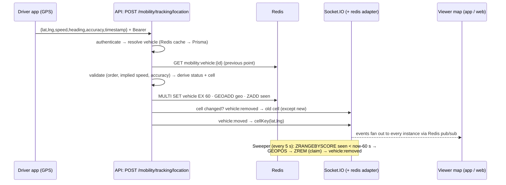

# Real-Time Vehicle Tracking: Implementation Plan

## Status (2026-09-25)

Phases 1–3, 4.1 and 5.1–5.2 are implemented. Phase 4.2 (web viewer) and the on-phone steps of 5.3 are still open.

**Verified against real Redis** (redis:7, two API instances on :4003 and :4004, simulator → A, `watch-vehicles` viewers → B):

| Check                                          | Result                                                              |
| ---------------------------------------------- | ------------------------------------------------------------------- |
| Parked → moving                                | three `stopped` pings, then `moving`                                |
| Cross-instance fan-out                         | every `vehicle:moved` from A reached both viewers on B              |
| Cell change, viewer watching only the old cell | `vehicle:removed` at the crossing ping                              |
| Cell change, viewer watching both cells        | no removal, only the next `moved` (`.except()` works)               |
| Keys                                           | `mobility:vehicle:*` TTL 59–60; GEO member and `seen` score present |
| Snapshot `GET /vehicles/live` on B             | returns the vehicle with `status` and `accuracy`; empty for Manila  |
| Driver killed without `/stop`                  | `vehicle:removed` 60s after the last ping; GEO and `seen` emptied   |

**Departures from the plan below:**

- **Snapshot box size (§3.1).** Oversized snapshot boxes are **not** rejected. The app asks for `centre ± 360/2^zoom`, which is wider than 2° at zoom 7 and below, so a 422 would break the zoomed-out map. `GEOSEARCH … COUNT 500` bounds the cost instead.
- **`stoppedSince`** is part of the `vehicle:moved` payload, so clients can show "stopped 3 min".
- **Simulator (§5.2).** `--cross` is implemented. `--vehicles N` is not: `Vehicles.driverUserId` is unique, so each extra vehicle needs its own seeded driver account.
- **Heartbeat (§1.2).** The app checks every 5s and re-sends only after 30s with nothing sent, so the longest silence is about 35s. A plain 30s periodic timer that skips when a send is recent can leave gaps of up to 60s, as long as the TTL.
- **App fix (not in the plan).** Stopping sharing now clears the last fix, so a restarted shift can't heartbeat the previous shift's position as "now".

## Context

The God's Eye map already works as a first version:

- **API commit `6df3148`**: the `src/modules/mobility/` module, `POST /v1/mobility/tracking/location`, and the `vehicle:moved` / `vehicle:removed` emits to `cell:*` rooms.
- **App commit `830feca`**: `DriverTrackingController`, `GodsEyeController`, and `VehicleLayer`.

This version is not production-ready, for these reasons:

| Gap                                                                                                                                                                | Where                                                                                   |
| ------------------------------------------------------------------------------------------------------------------------------------------------------------------ | --------------------------------------------------------------------------------------- |
| Live state is an **in-process `Map`**. It is lost on restart and invisible to a second API instance.                                                               | `mobility.service.ts:19`                                                                |
| Vehicles that go silent are never actively removed, so no `vehicle:removed` is emitted on timeout. Cleanup happens lazily, only inside `liveInBounds`.             | `mobility.service.ts:172-183`                                                           |
| The snapshot query scans every live vehicle linearly. There is no spatial index.                                                                                   | same                                                                                    |
| A vehicle that crosses into a new cell sends nothing to the old cell, so viewers of that cell see a ghost for up to 60 s.                                          | `socket/index.ts:219-231`                                                               |
| There is no Socket.IO Redis adapter, so emits reach only sockets on the same instance.                                                                             | `socket/index.ts:106`                                                                   |
| Each ping costs 2 DB queries (the auth user and the driver→vehicle lookup).                                                                                        | `mobility.service.ts:135`                                                               |
| The app sends a fix every ≥4 s (5 s interval on Android, 10 m distance filter, best accuracy). That drains the battery, and the payload has **no accuracy field**. | `driver_tracking_controller.dart:28,110-130`, `mobility_remote_datasource.dart:122-130` |

**Target:** live positions live only in Redis: a JSON key with a 60 s TTL, a GEO index, and an expiry sweeper. Drivers send one fix every 10–15 s that includes accuracy. The server works out movement and cell transitions and emits them to the affected cells, and multiple API instances share state through Redis.

**Non-goals:**

- Location history (`VehicleLocationHistory` through RabbitMQ; see spec §15).
- Socket authentication.
- A DRIVER system role.

Live GPS is **not** written to Postgres today, and this plan keeps it that way. **No Prisma schema change is needed.**

### Target data flow



---

## Phase 1: Client-side tracking and optimization (Flutter app)

Repo: `mapanytime-market-app`. The app changes are safe to ship before the API, because the API validates with Joi `stripUnknown`, so an `accuracy` field it does not know yet is dropped instead of rejected.

### 1.1 Update interval (4 s → 10–15 s)

In `lib/features/mobility/presentation/driver_tracking_controller.dart`:

- `_minSendGap`: 4 s → **10 s** (L28).
- Android `intervalDuration`: 5 s → **10 s** (L115). This keeps the GPS chip from waking more often than we send.
- `distanceFilter`: 10 m → **25 m** (L111). At city speeds of 20 km/h (5.5 m/s), a vehicle covers 55 m in 10 s, so a moving vehicle still sends every interval.
- `_heartbeat`: 20 s → **30 s** (L29). This stays under the 60 s TTL and leaves room for one lost request.

### 1.2 Battery optimization

- **Adaptive send.** While moving, send at most once every 10 s. When stationary (speed < 1.5 m/s on the last 2 fixes), send nothing new; the 30 s heartbeat alone keeps the vehicle on the map. A jeepney waiting at a terminal drops from about 6 requests a minute to 2.
- **Accuracy mode.** Set `accuracy: LocationAccuracy.high` instead of the implicit `best` on both `AndroidSettings` and `AppleSettings`. `best` keeps the GPS at full power for no visible gain at street scale.
- **Discard bad fixes on the device.** Skip fixes with `p.accuracy > 50 m`, because they are noise and would fail the server check anyway. The heartbeat still re-sends the last _good_ fix.
- **Keep iOS `pauseLocationUpdatesAutomatically` false** (the geolocator default). Pausing ends updates for good unless region monitoring is added.
- **Put the decision in a pure function** so it can be tested: `bool shouldSend({required Position fix, required DateTime lastSentAt, required Position? lastSent, required DateTime now})` in the same file. `_onPosition` calls it.
- **Android 13+ notifications.** Add `<uses-permission android:name="android.permission.POST_NOTIFICATIONS"/>` to `android/app/src/main/AndroidManifest.xml`, and request it through `permission_handler` in `start()`. Without it, the foreground-service notification can be hidden and the OS kills tracking sooner.

### 1.3 Payload: timestamp and accuracy

In `lib/features/mobility/data/mobility_remote_datasource.dart` L122-130, `sendLocation`:

```dart
'accuracy': p.accuracy,                                   // metres, 68% radius
'timestamp': (at ?? p.timestamp).millisecondsSinceEpoch,  // already present
```

Also read the new server fields (`status`, `accuracy`) in `LiveVehicle.fromJson` (L10) as optional, with defaults.

### 1.4 Tests

- New `test/features/mobility/driver_tracking_test.dart` testing `shouldSend`:
  - throttle gap
  - stationary suppression
  - dropping low-accuracy fixes
  - heartbeat still firing
- Extend `test/features/mobility/gods_eye_test.dart` so `fromJson` handles `status` and `accuracy` with and without values.
- Checks: `dart format --set-exit-if-changed .`, `flutter analyze`, `flutter test`.

---

## Phase 2: Backend architecture and Redis (API)

Repo: `mapanytime-api`.

### 2.1 Stop keeping live data in process memory

Delete the `live` Map and the "ponytail" comment in `src/modules/mobility/mobility.service.ts:16-19`. All live state goes through a new **`src/modules/mobility/mobility.live-store.ts`**. It is the only file that knows Redis keys, so the service stays readable and tests can mock one module. Nothing is written to Postgres; this is already true and stays true.

The client is **`RedisUtil.client`** (`src/utils/redis.util.ts`). It is awaited before `listen` in `server.ts:27` and already backs the scheduler lock. Every live-store function checks `client?.isOpen` and throws `{ status: 503, message: 'Live tracking unavailable' }` when Redis is down. That way a driver gets a clear error instead of a crash.

### 2.2 Redis keys, TTL and GEO

This follows the naming in `MOBILITY_GODS_EYE_ARCHITECTURE.md` §10.

| Key                            | Type          | Content                                      | Expiry                                             |
| ------------------------------ | ------------- | -------------------------------------------- | -------------------------------------------------- |
| `mobility:vehicle:{vehicleId}` | string (JSON) | `VehicleEventPayload` plus `stoppedSince`    | `SET … EX 60`, **the 60 s TTL**                    |
| `mobility:geo:vehicles`        | GEO (zset)    | member `vehicleId` at `lng,lat`              | members cannot expire, so the sweeper removes them |
| `mobility:seen`                | zset          | `vehicleId` → server receipt time (ms)       | the sweeper removes them                           |
| `mobility:driver:{userId}`     | string (JSON) | `{ id, plateNumber, typeCode }`, or `"none"` | `EX 60`; deleted on vehicle or operator update     |

**Redis GEO notes** (redis:7-alpine in `docker-compose.yml` supports all of this):

- `GEOADD` stores a 52-bit geohash as the zset score. `GEOSEARCH … BYBOX w h km` costs O(N + log M), which replaces the linear scan.
- A GEO member **cannot carry a TTL**. That is why `mobility:seen` exists: it records when each member was last refreshed, so the sweeper can find expired ones. Scores use _server_ time, so a device clock cannot keep a vehicle alive.
- The JSON key's own TTL is the second safeguard. `liveInBounds` drops any GEO hit whose JSON key has already expired, so stale vehicles never show up, even between sweeps.

Live-store API:

```ts
getLive(vehicleId): Promise<LivePoint | null>                    // GET + JSON.parse
putLive(point: LivePoint): Promise<void>                         // MULTI: SET EX 60 · GEOADD · ZADD seen now
removeLive(vehicleId): Promise<LivePoint | null>                 // GET, then MULTI: DEL · ZREM geo · ZREM seen
searchBox(b: Bounds, limit = 500): Promise<LivePoint[]>          // GEOSEARCH FROMLONLAT centre BYBOX → MGET → drop nulls → exact-bounds filter
claimExpired(now): Promise<{ id; lat; lng }[]>                   // ZRANGEBYSCORE seen 0 now-60000 → GEOPOS → per id ZREM seen (claim == 1) → ZREM geo
getCachedVehicle(userId) / cacheVehicle(userId, v) / invalidateDriver(userId)
```

### 2.3 Cache the driver→vehicle lookup

Wrap the Prisma lookup at `mobility.service.ts:135-139` in `mobility:driver:{userId}` with `EX 60`. Negative results are cached as `"none"`, so a stranger spamming the endpoint does not hit Postgres. Invalidate it in:

- `updateVehicle`, for both the old and the new `driverUserId`, alongside the existing `dropLive` at L118;
- `createVehicle`;
- `updateOperator`: when `isActive` becomes false, also call `dropLive` for each of that operator's vehicles.

The existing auth lookup (`auth.middleware.ts`, 1 query) stays as it is and is out of scope. At 10 s pings it costs 0.1 query per driver per second.

### 2.4 Expiry sweeper (emits `vehicle:removed` on timeout)

Add a `startVehicleSweeper()` / `stopVehicleSweeper()` pair to `mobility.service.ts`. It uses `setInterval` every **5 s**; node-cron's 1-minute granularity is too coarse.

- It runs in the **API process**, because that is where `io` lives. The worker has no socket server.
- It is started in `src/server.ts` after `RedisUtil.initialize()`, and stopped in `gracefulShutdown`.
- **It needs no lock when several instances run it.** `claimExpired` uses the result of `ZREM mobility:seen id` as an atomic claim, and only the instance that removed the member emits `vehicle:removed`. (`withJobLock` in `src/infrastructure/scheduler/index.ts:19` would also work, but it would skip whole ticks on lock contention.)

### 2.5 Prepare for horizontal scaling

- **Socket.IO Redis adapter.** Run `npm i @socket.io/redis-adapter`. Then:
  - In `src/infrastructure/socket/index.ts`, add `export async function attachRedisAdapter(client)`. It creates `pub = client.duplicate()` and `sub = pub.duplicate()`, awaits `connect()` on both, and calls `io.adapter(createAdapter(pub, sub))`.
  - Call it from `server.ts` after `RedisUtil.initialize()` and before `listen`, and close both clients during shutdown.
  - With the adapter, `io.to(cell).emit(...)` from any instance reaches viewers connected to every instance.
- **Sticky sessions.** Web clients start on HTTP long-polling (the default in `mapanytime-market-web/src/shared/lib/socket.ts`). With more than one instance behind the load balancer, polling requests must stick to one instance, using ALB target-group stickiness. The Flutter client is websocket-only and does not need it.
  - Check how many instances `deploy-production.yml` targets before scaling out.
  - Record this requirement in the spec.
- **Shared state.** Nothing in the mobility module is held in process memory any more. The only per-socket state is the room membership, which the adapter handles.

### 2.6 Tests (API)

Rewrite `tests/unit/mobility.tracking.test.ts`. Today it depends on the module-level Map.

- In the service tests, mock `mobility.live-store` with `jest.fn()`s and assert the calls and emits.
- Add a new `tests/unit/mobility.live-store.test.ts` with a small hand-written fake for `RedisUtil.client`, implementing `get/set/multi/geoAdd/geoSearch/mGet/zAdd/zRangeByScore/zRem/geoPos`. The repo has no redis-mock, and GEO commands need faking anyway.
- Cases:
  - `putLive` sets EX 60
  - `searchBox` drops expired JSON
  - `claimExpired` emits once when two sweepers race (the second `zRem` returns 0)
  - 503 when the client is closed

Remember that green tests do not prove anything against real Redis. Phase 5 does that check.

---

## Phase 3: Real-time socket infrastructure (API)

### 3.1 Location recording endpoint

`POST /v1/mobility/tracking/location` → `MobilityController.recordLocation` → `MobilityService.recordLocation(userId, input)` already exists over HTTPS with `authenticate` (`mobility.route.ts:15`). Changes:

- **Joi** `locationSchema()` (`mobility.controller.ts:48-59`): add `accuracy: Joi.number().min(0).max(10_000).allow(null)`. It is **optional**, so older app builds keep working.
- **`LocationInput`** (`mobility.service.ts:21-28`): add `accuracy?: number | null`.
- **`VehicleEventPayload`** (`socket/index.ts:208-217`): add `accuracy: number | null` and `status: 'moving' | 'stopped'`. Both are additive, and existing clients ignore unknown fields.
- **Server-side accuracy gate**: `accuracy > 100 m` → 422 `'Location accuracy too low'`. The client already filters at 50 m, so this is only a backstop.
- **Controller `liveVehicles`** (L171-177): add `await`, because `liveInBounds` becomes async. Reject boxes wider than 2° with a 422, so one request cannot sweep the whole country.

New `recordLocation` body:

```ts
const vehicle = await resolveVehicle(userId);              // cache → Prisma; 403 if none
if (input.accuracy != null && input.accuracy > MAX_ACCURACY_M) throw 422;
const prev = await live.getLive(vehicle.id);               // null ⇒ first fix / expired
if (prev) { order check; implied-speed check using
            max(0, km - (prev.accuracy + input.accuracy)/1000) }   // accuracy-aware: less false 422s
const point = { ...payload, status, stoppedSince };        // §3.2
await live.putLive(point);
emitVehicleMoved(point, prev);                              // §3.3
return point;
```

### 3.2 State transitions (stopped at A → moving to B)

Worked out on the server from `prev` and the new fix, so every client sees the same status:

- **moving**: `speed ≥ 5 km/h`, or distance from `prev` > `max(25 m, prev.accuracy + input.accuracy)`.
- **stopped**: everything else. `stoppedSince = prev?.status === 'stopped' ? prev.stoppedSince : now`.

The transitions are:

- **first fix** (no `prev`) → `moved` event with the derived status;
- **moving → stopped** at A → `moved` event with `status: 'stopped'`;
- **heartbeats while stopped** → `moved` event with the same status (this renews the client's 60 s TTL);
- **stopped → moving** toward B → `moved` event with `status: 'moving'`;
- **leaving the cell** → the cell-change pair in §3.3;
- **stop, timeout or deactivation** → `removed`.

The distance threshold uses accuracy so GPS jitter while parked does not flip the status back and forth.

### 3.3 Event emitting and targeted broadcasts

In `src/infrastructure/socket/index.ts`, change the helper signature to `emitVehicleMoved(vehicle, prev?: { lat; lng } | null)`. `cellKey` stays private to the socket module.

```ts
const room = cellKey(vehicle.lat, vehicle.lng);
if (prev) {
  const oldRoom = cellKey(prev.lat, prev.lng);
  // Viewers of the old cell drop it now, not after 60 s. Sockets subscribed to BOTH
  // cells are excepted, so a viewer straddling the boundary never sees a flicker.
  if (oldRoom !== room) io.to(oldRoom).except(room).emit('vehicle:removed', { id: vehicle.id });
}
io.to(room).emit('vehicle:moved', vehicle);
```

- `emitVehicleRemoved(id, lat, lng)` is unchanged. It is used by `stopTracking`, `dropLive` (now `live.removeLive` + emit), and the sweeper.
- The events stay limited to `io.to(cellKey(...))`, using the existing 0.1° grid and the `subscribe` handler (L127-135), so there is never a global broadcast.
- Rewrite the doc comment at L219-222: "clients drop vehicles not heard from in 60 s" becomes "the server emits `vehicle:removed` on cell exit, stop, and timeout; the client 60 s prune is a fallback".

### 3.4 Tests

Add to `tests/unit/mobility.tracking.test.ts`:

- the status derivation table (first fix, stopped, jitter while parked stays stopped, starts moving);
- the cell crossing emits `removed` with `.except` and then `moved`;
- the same cell emits only `moved`;
- accuracy-aware speed check;
- 422 for `accuracy > 100`;
- `accuracy` is optional.

For the controller: `accuracy` validation, and `liveVehicles` awaits and rejects oversized boxes.

---

## Phase 4: Application data flow, end to end

Every hop of the required flow, mapped to code:

| Step              | Component                                                                         | File                                                           |
| ----------------- | --------------------------------------------------------------------------------- | -------------------------------------------------------------- |
| 1. Driver GPS     | geolocator stream, `shouldSend`                                                   | app `driver_tracking_controller.dart`                          |
| 2. HTTPS / API    | `sendLocation` → `POST /mobility/tracking/location`                               | app `mobility_remote_datasource.dart`, api `mobility.route.ts` |
| 3. Authentication | `authenticate` (JWT + active session) → `resolveVehicle` (cached)                 | api `auth.middleware.ts`, `mobility.service.ts`                |
| 4. Redis          | `putLive`: SET EX 60 · GEOADD · ZADD seen                                         | api `mobility.live-store.ts`                                   |
| 5. Socket.IO      | `emitVehicleMoved` / `emitVehicleRemoved` → cell rooms, through the Redis adapter | api `socket/index.ts`                                          |
| 6. Viewer / map   | snapshot `GET /vehicles/live` plus socket events → GeoJSON layer                  | app `gods_eye_controller.dart`, `vehicle_layer.dart`           |

### 4.1 Viewer hardening (Flutter)

- **Re-subscribe on reconnect.** `lib/features/worldMap/data/datasources/store_socket_datasource.dart` does not re-emit `subscribe` after a reconnect. With several instances, a reconnect can land on another instance with no room membership, so the map stops updating without any error.
  - Store the last viewport and emit it again in `onConnect`, the same pattern as `notification_socket_datasource.dart:26-47`.
  - On reconnect, also re-run `loadSnapshot()` to catch up.
- **Smooth movement.** With updates every 10–15 s, markers jump farther. In `vehicle_layer.dart`, tween each vehicle from its last position to the new one over about 1 s at the existing 1 s render gap, or simply use a lerp in the render tick.
- **Stopped styling.** Give `status == 'stopped'` a slightly dimmed icon or dot through a data-driven `iconOpacity`.
- `GodsEyeController`'s 60 s client prune stays as a fallback.

### 4.2 Web viewer (separate PR, optional for this milestone)

`mapanytime-market-web` has no vehicle map yet. When it is in scope, follow the report conventions:

- **New feature `src/features/live-map/`** with:
  - `contracts/vehicle.contract.ts`: Zod schemas for `VehicleEventPayload`;
  - `lib/cells.ts`, the bounds→viewport helper, with a Vitest test;
  - `hooks/useVehicleStream.ts`, built on `acquireSocket`/`releaseSocket` from `src/shared/lib/socket.ts`: emit `subscribe` on `connect` and when already connected, keep positions in a ref `Map`, and do not store them in React state;
  - `components/LiveVehicleMap.tsx`: one GeoJSON source with `setData`, a debounced `moveend`, and layers re-added on `style.load`, copying `src/components/home/LiveHeroMap.tsx`.
- Load it with `dynamic(..., { ssr: false })` in an `app/` page. Never export it from the feature's `index.ts`.
- Gates: `pnpm validate && pnpm lint && pnpm type-check && pnpm test`.

---

## Phase 5: Deliverables, demo, PR

### 5.1 How the pieces connect (explanation doc)

- Save this file as `mapanytime-api/docs/specs/MOBILITY_REALTIME_TRACKING_PLAN.md`.
- Update `MOBILITY_GODS_EYE_ARCHITECTURE.md` §10 to match the implemented keys and the sweeper, and add the sticky-session note.
- In `MOBILITY_ARCHITECTURE_EVALUATION_AND_FLAGS.md`, mark the flags this resolves (in-process state, multi-instance, ghost vehicles).

### 5.2 Demo tooling

- **`scripts/simulate-vehicle.ts`**:
  - `PING_MS` 3 000 → 10 000 (L22);
  - send `accuracy` (random 5–20 m);
  - add `--vehicles N` and a `--route cross` mode that drives across the `lat = 16.4` cell boundary near Baguio, with a 30 s parked stop partway, so one run shows a stop, a restart and a cell change.
- **New `scripts/watch-vehicles.ts`**: a `socket.io-client` viewer that takes `--url` and a viewport, emits `subscribe`, and logs every `vehicle:moved` / `vehicle:removed` with its status and cell.

### 5.3 Demo script (before opening PRs)

1. Run `docker compose up db redis redis-insight rabbitmq`. Start API **A** on :4002. Start API **B** on :4003 with `PORT=4003 npm run dev`, pointing at the same Redis.
   - Remember the stale-server gotcha: make sure nothing else is bound to :4002.
2. Run `watch-vehicles --url http://localhost:4003` (viewer on B), and send the simulator to A.
   - This proves the adapter works: events travel from instance A to a viewer on B.
3. In RedisInsight, check that `mobility:vehicle:*` counts its TTL down from 60, that `mobility:geo:vehicles` holds members, and that `mobility:seen` scores advance.
4. Watch the stop → `status: 'stopped'` and the restart → `'moving'`. At the boundary, a `removed` arrives in the old cell and a `moved` in the new one.
5. Kill the simulator. Within ≤65 s (60 s TTL plus a 5 s sweep), the watcher logs `vehicle:removed`, and the keys and GEO member are gone.
6. On the phone: start sharing, walk or drive, check that pings arrive about every 10 s while moving and about every 30 s while parked, and check the foreground notification on Android 13+.
   - The phone must use the PC's LAN IP in `BASE_URL`, not `10.0.2.2` or `localhost`.
7. Record the screen of the app map, the watcher and RedisInsight side by side for the PR.

### 5.4 PRs (one per repo, API first)

1. **`mapanytime-api`**: Phases 2–3, scripts, docs. Gates: `npm run lint`, `npm run test:unit`, `npm run build`.
2. **`mapanytime-market-app`**: Phases 1 and 4.1.
3. **`mapanytime-market-web`**: Phase 4.2, when scheduled.

---

## Critical files

**API**

- `src/modules/mobility/mobility.service.ts`, `mobility.controller.ts`, new `mobility.live-store.ts`
- `src/infrastructure/socket/index.ts`
- `src/server.ts`
- `scripts/simulate-vehicle.ts`, new `scripts/watch-vehicles.ts`
- `tests/unit/mobility.tracking.test.ts`, new `tests/unit/mobility.live-store.test.ts`
- `package.json` (`@socket.io/redis-adapter`)

**App**

- `lib/features/mobility/presentation/driver_tracking_controller.dart`, `vehicle_layer.dart`
- `lib/features/mobility/data/mobility_remote_datasource.dart`
- `lib/features/worldMap/data/datasources/store_socket_datasource.dart`
- `android/app/src/main/AndroidManifest.xml`

**Reused as they are**

- `haversineKm` (`src/utils/geo.util.ts`)
- `RedisUtil.client`
- the `cellKey`/`cellsForViewport` grid
- the `authenticate` middleware
- the `acquireSocket` pattern (web)

## Verification

- **Unit tests:** API `npm run test:unit` (Phases 2–3 cases); app `flutter test` (`shouldSend`, `fromJson`).
- **Real Redis:** demo steps 3–5 above. Mocked tests do not prove the GEO and TTL behaviour.
- **Multiple instances:** demo step 2, with the viewer on B and the driver on A.
- **Battery sanity check:** Android Studio Energy Profiler, or a 30-minute drive, comparing the GPS wake count and request count before and after.
- **Backward compatibility:** an old app build without `accuracy` still gets 200, and the old `LiveVehicle.fromJson` still parses the new payload.
